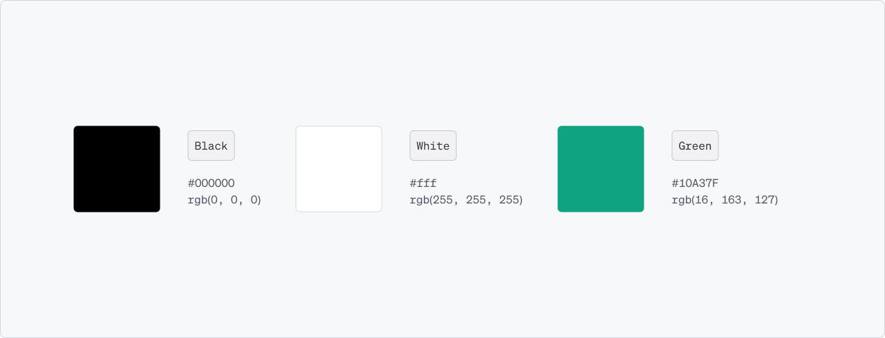
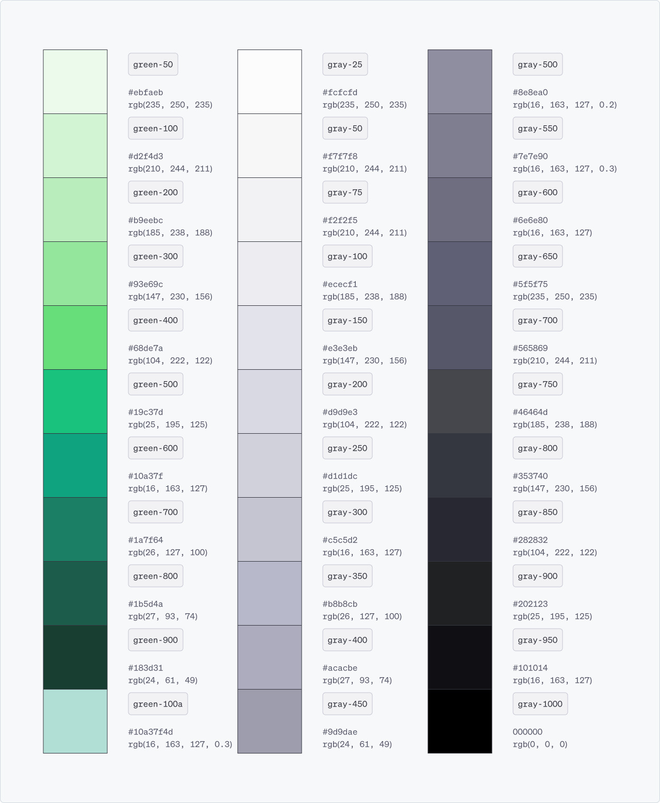
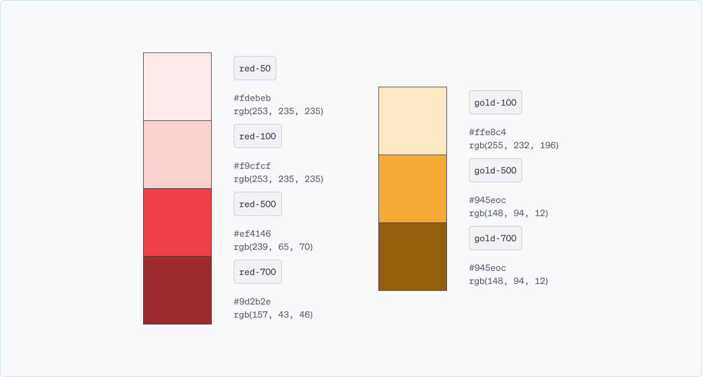

import { Meta } from '@storybook/blocks';

<Meta name="Colors" title="Tokens/Colors" />

# Colors

Color is a powerful tool that enables users to quickly grasp the information hierarchy and understand the structure and importance of various elements of OpenAI.

## Core Colors

Lumina uses three core colors that establish the visual identity and consistency of the OpenAI brand, ensuring immediate recognition across all mediums. They play a crucial role in creating a cohesive look and feel, guiding our user's attention and supporting the overall design hierarchy.

Color Scale

Color scales of Lumina’s core colors have been prepared, offering flexibility and depth in design while maintaining brand coherence. They enable the creation of a visual hierarchy by allowing differentiation between elements such as backgrounds, buttons, and text. Furthermore, color scales support accessibility by providing sufficient contrast options, ensuring readability and usability for all users.

Semantic Colors

Semantic colors are specifically designated for conveying particular meanings or statuses within a user interface, such as errors, warnings, success messages, and informational alerts. These colors are not necessarily part of the core brand colors but are used consistently across the design system to communicate specific feedback or states to users. 

By using semantic colors, users can quickly and intuitively understand the significance of different UI elements, enhancing both usability and accessibility.

