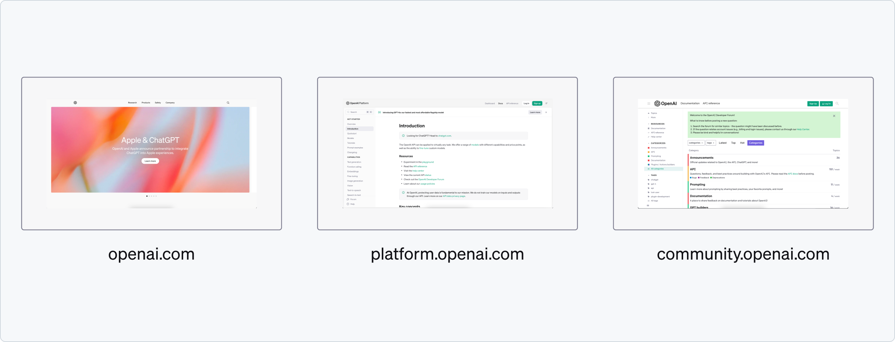

import { Meta } from '@storybook/blocks';

<Meta name="OpenAI" title="OpenAI" />

# OpenAI

OpenAI is an artificial intelligence research lab that focuses on developing and promoting friendly AI in a way that benefits humanity as a whole. 

The organization was founded with the mission to ensure that artificial general intelligence (AGI)—highly autonomous systems that outperform humans at most economically valuable work—advances in ways that are safe and broadly beneficial. OpenAI conducts research and development in AI technologies, aiming to create collaborative systems that enhance and extend human capabilities. Additionally, they develop and deploy AI tools and technologies, such as the popular language models known as GPT (Generative Pre-trained Transformer) and others like DALL-E, a model designed for generating images from textual descriptions.

## Assessment

Our assessment of OpenAI's visual design reveals inconsistencies across their branding guidelines, platform website, and main product, ChatGPT. 

The branding guidelines do not align with the visual conventions observed on their platform website or within ChatGPT itself, leading to a disjointed brand experience. This inconsistency could impact user perception and brand cohesion.

