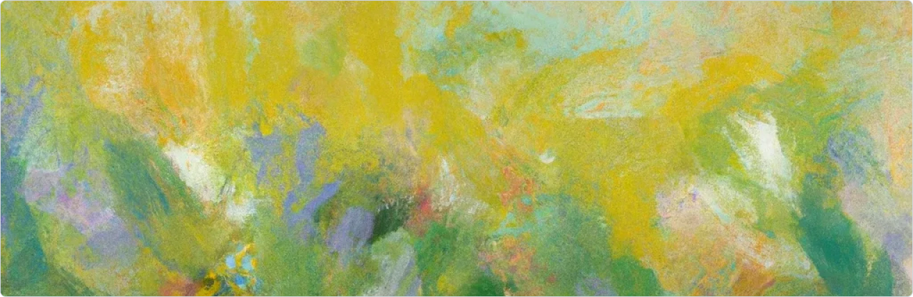

import { Meta } from '@storybook/blocks';

<Meta name="Voice and Tone" title="Voice and Tone" />

# Voice and Tone

The Lumina voice and tone serve as crucial links between our brand and our users, ensuring communication is not only clear and consistent but also deeply reflective of our brand's core values. This directly shapes how our users perceive and interact with our brand, enhancing their overall experience.

## Voice

The voice of OpenAI Lumina is clear, intelligent, and authoritative, embodying the brand's commitment to innovation and accessibility in AI. It consistently communicates in a way that reflects reliability and expertise, aiming to engage users by providing clarity and depth in understanding AI technologies.

## Tone

The tone of OpenAI Lumina would vary depending on the context but always aims to be inclusive and user-friendly.

Below are guidelines we follow: 

**Technical Documentation**
- Precise and informative
- Detailing API functionalities, system architectures, or model training processes where accuracy and clarity are the priority.

**Marketing Materials**
- Inspiring and visionary
- Promotional content or advertising that highlights the cutting-edge nature of OpenAI Lumina, aiming to captivate and attract potential users or investors.

**User Support and FAQs**
- Friendly and supportive
- Help sections, troubleshooting guides, and FAQ pages where the goal is to assist users in a welcoming and accessible manner.

**Educational Content**
- Engaging and encouraging
- Tutorials, webinars, and articles aimed at educating users about AI and how to use OpenAI Lumina effectively, fostering a sense of learning and exploration.

**Community Interaction**
- Conversational and inclusive
- Social media posts, forum discussions, and user group interactions where the tone is more relaxed and aimed at building a community.

**Policy and Ethics Discussions**
- Thoughtful and responsible
- White papers, public statements, or panel discussions on the ethical use of AI and OpenAI’s commitments to safety and fairness in AI development.